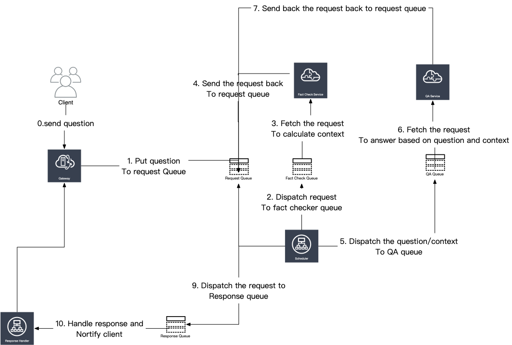
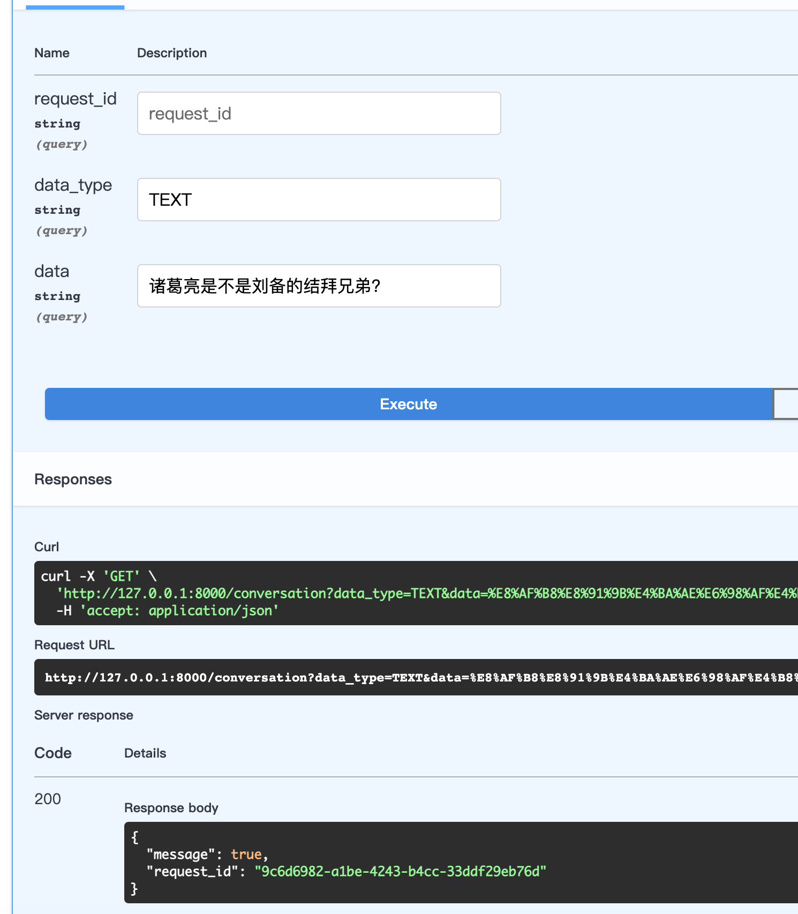
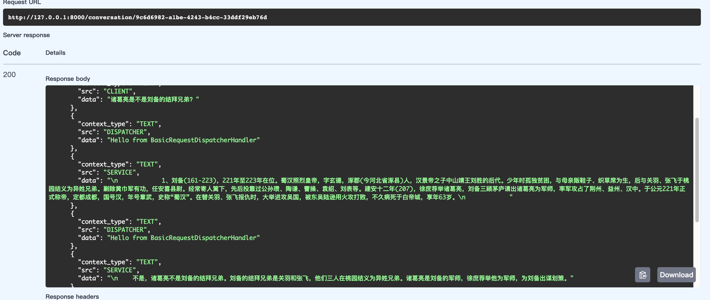
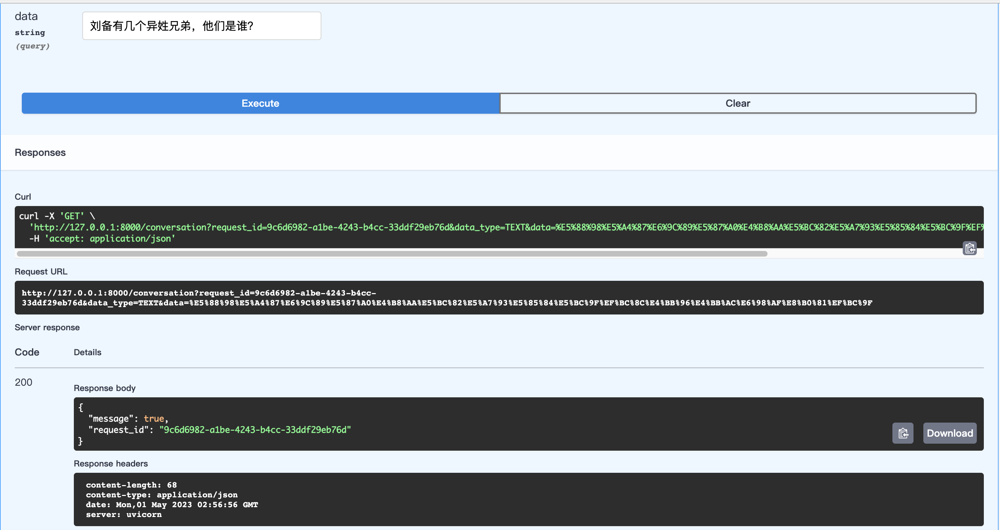
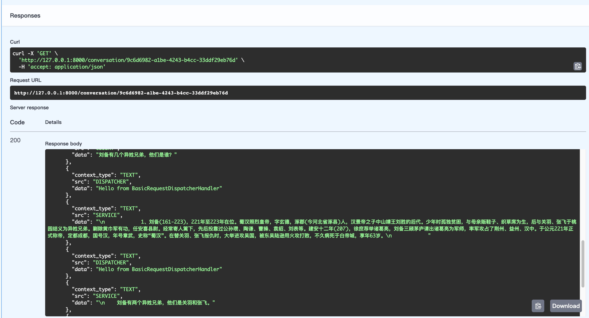

# Summary

The LLMs like OpenAI's ChatGPT can generate fluent texts that are similar to human's. But they are not good at answering questions without provided facts. For an example, if you ask "刘备的异姓兄弟有几个，都是谁？", the result from OpenAI API is "刘备有三个异姓兄弟，他们是刘表、刘璋和刘琦。". It's an obvious wrong answer that's so easy for a Chinese teenager to answer. The reason is that even the biggest LLMs like GPT-3.5 doesn't have all knowledge in the world. Let's enhance them with the basic knowledge of the world.

# Architecture of the fact based QA service

The fact based QA service's workflow is :
1. Get the question from the user.
2. Retrive the fact from a information retrieval system accoring to the question.
3. Feed the question and the fact to a LLM to get the answer.

The architecture of the fact based QA service in MMFSTF is :



Compared with the framework, there 3 components we need to add to the framework to build the fact based QA service. They are :
1. Fact check service: It's a service that can retrive the fact from a information retrieval system accoring to the question. The Fact Check Queue is the queue that the fact check service listens to.
2. QA service: It's a service that can feed the question and the fact to a LLM to get the answer. The QA Queue is the queue that the QA service listens to. The context is fetchted by the fact check service.
3. Scheduler: It's a modified version of the request dispatcher. It's responsible to dispatch the client question to the fact check service and the request from the check service to the QA service, finally it will dispatch the answer from the QA service to the response queue which will be handled by the standard handler message and the client will get the answer.

# The source code and the scripts to run the whole system.

1. The gateway
* The source code is in src/gateway/gateway.py
This is a fastapi based gateway. It has two interface:
    * /conversation
    
    This is the interface that the client can use to ask questions. The client can send a GET request with three parameters like:
    ```
    request_id: str It's a unique id for the request. If the request already exits, for an example, the conversation is established, the gateway will check if this is the client turn to ask question. If it is, the question will be appended to the context. If it is not, it will return a json to ask client be patient to wait until last round is finished by the server side counterpart. If request_id is not provided, the gateway will generate one and return it to the client.

    data_type: currently we only support TEXT. IMAGE and AUDIO will be supported soon.
    data: it's the question itself in TEXT format like "刘备的异姓兄弟有几个，都是谁？"
    ```
    This call will return a json like :

    ```json
    {
        "message": true,
        "request_id": "30d6eeb0-77e1-46bd-850f-0334389ff128"
    }
    ```
    Submit the question successfully.

    or
    ```json
    {
        "message": "Please wait for response patiently",
        "request_id": "30d6eeb0-77e1-46bd-850f-0334389ff128"
    }
    ```
    Last round question is still being processed, ask the user to wait patiently.

    * /conversation/{request_id}
    
    This is the interface to get current conversation's detailed information. The results looks like :
    ```json
    {
  "message": {
    "request_id": "30d6eeb0-77e1-46bd-850f-0334389ff128",
    "request_status": "RESPONSE|20",
    "contexts": [
      {
        "context_type": "TEXT",
        "src": "CLIENT",
        "data": "刘备和诸葛亮认识了多少年？"
      },
      {
        "context_type": "TEXT",
        "src": "DISPATCHER",
        "data": "Hello from BasicRequestDispatcherHandler"
      },
      {
        "context_type": "TEXT",
        "src": "SERVICE",
        "data": "\n            1、刘备(161-223)，221年至223年在位。蜀汉照烈皇帝，字玄德，涿郡(今河北省涿县)人，汉景帝之子中山靖王刘胜的后代。少年时孤独贫困，与母亲贩鞋子、织草席为生，后与关羽、张飞于桃园结义为异姓兄弟。剿除黄巾军有功，任安喜县尉。经常寄人篱下，先后投靠过公孙瓒、陶谦、曹操、袁绍、刘表等。建安十二年(207)，徐庶荐举诸葛亮，刘备三顾茅庐请出诸葛亮为军师，率军攻占了荆州、益州、汉中。于公元221年正式称帝，定都成都，国号汉，年号章武，史称“蜀汉”。在替关羽、张飞报仇时，大举进攻吴国，被东吴陆逊用火攻打败，不久病死于白帝城，享年63岁。\n            "
      },
      {
        "context_type": "TEXT",
        "src": "DISPATCHER",
        "data": "Hello from BasicRequestDispatcherHandler"
      },
      {
        "context_type": "TEXT",
        "src": "SERVICE",
        "data": "\n    刘备和诸葛亮认识了14年，从建安十二年(207)到刘备病死于白帝城的公元223年。"
      },
      {
        "context_type": "TEXT",
        "src": "DISPATCHER",
        "data": "Hello from BasicRequestDispatcherHandler"
      },
      {
        "context_type": "TEXT",
        "src": "RESPONSE_HANDLER",
        "data": "Hello from RESPONSE_HANDLER"
      }
    ]
  },
  "request_id": "30d6eeb0-77e1-46bd-850f-0334389ff128"
}
    ```
    Client can use this interface to check the conversation status and the conversation context or final answer.
2. The request dispatcher
* The source code is in src/request_dispatcher/facts_based_request_dispatcher.py
This file contains a main function to start the request dispatcher. It will start a scheduler to dispatch the request to the fact check service and the QA service. The scheduler will also dispatch the answer from the QA service to the response queue which will be handled by the standard handler message and the client will get the answer.
3. The fact checker service
* The source code is in src/services/langchain/fact_checker_service.py
This file contains a main function to start listening the fact check queue. Currently we only return a fixed context. Later we will build a context library and fetch the context using bi-cross encoder and rerank the  resuluts using cross-encoder.
4. The QA service
* The source code is in src/services/langchain/basic_openai_service.py
This file contains a main function to start listening the QA queue. We will use OpenAI API to fetch the answer after feeding the context and question to the OpenAI API. It's a standard LangChain chain, in theory, we can easily replace  OpenAI withou other LLMs or even local LLMs.

5. Response handler
* The source code is in src/request_dispatcher/basic_response_handler.py

Handle all kinds of response and contexts and format them to the standard response format. You can change the response handler to addapt different applications.

## How to run the code
Just run the above 5 services, it's unnecessary to run them in the same machine as long as they share the same mq.json, redis.conf. Every service is totally decoupled from others, so you're free to modify any of them and restart/debug without affecting others.

## Some snapshots

1. Ask a question :"诸葛亮是不是刘备的异姓兄弟？"

2. The final answer is :"不是，诸葛亮不是刘备的结拜兄弟。刘备的结拜兄弟是关羽和张飞，他们三人在桃园结义为异姓兄弟。诸葛亮是刘备的军师，徐庶荐举他为军师，为刘备出谋划策。"

2. Ask another question :"刘备有几个异姓兄弟，他们是谁？"

3. The final answer is :"刘备有两个异姓兄弟，他们是关羽和张飞。"

